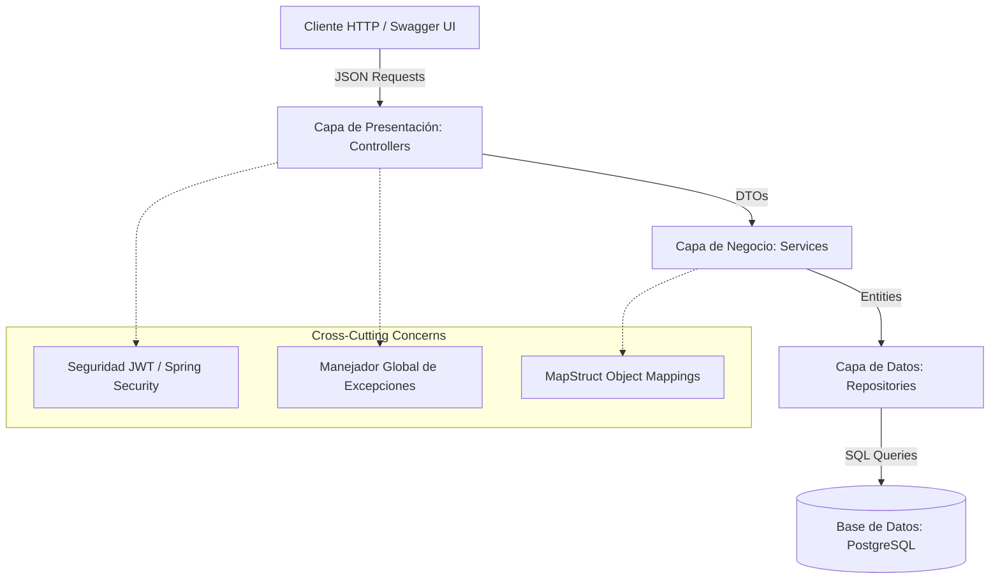

# Sistema de Gestión Hospitalaria - Prueba Técnica Spring Boot

Este proyecto es una API RESTful desarrollada con **Spring Boot** para la gestión de un sistema hospitalario. Permite la administración de pacientes, empleados (médicos), especialidades clínicas y el registro de atenciones médicas, todo bajo un esquema de seguridad basado en tokens JWT.

---

## 🛠️ Tecnologías y Versiones

La aplicación está construida sobre las siguientes tecnologías principales (extraídas de [pom.xml](file:///C:/Users/santyman/Desktop/master%20java%20springboot/hospital/pom.xml)):

| Tecnología / Dependencia | Versión | Descripción |
| :--- | :--- | :--- |
| **Java** | 21 | Versión LTS para programación robusta y moderna. |
| **Spring Boot Parent** | 4.0.6 | Framework base para el desarrollo del ecosistema Spring. |
| **Spring Data JPA** | *Gestionada* | Persistencia de datos y mapeo objeto-relacional (ORM). |
| **Spring Security** | *Gestionada* | Autenticación y control de accesos basados en roles. |
| **PostgreSQL Driver** | *Gestionada* | Conector para base de datos relacional PostgreSQL. |
| **Lombok** | 1.18.38 | Generación automática de código repetitivo (getters, setters, constructores, etc.). |
| **MapStruct** | 1.6.3 | Mapeo de alto rendimiento y tipo seguro entre Entidades y DTOs. |
| **Springdoc OpenAPI UI** | 2.8.13 | Generación automática de documentación de API interactiva (Swagger UI). |
| **JJWT (Java JWT)** | 0.12.6 | Generación y validación de tokens de seguridad JSON Web Token. |

---

## 🏛️ Arquitectura de N-Capas (Multi-Layered)

El proyecto implementa una arquitectura estructurada en capas limpias con responsabilidades separadas:



### Descripción de las Capas:
1. **Presentación (API REST) - `controller`**: Expone los endpoints HTTP y maneja la validación de entrada con `@Valid` y OpenAPI.
2. **Transferencia de Datos - `dtos` / `mapper`**: Objetos DTO de petición/respuesta y mappers de **MapStruct** para desacoplar el modelo interno de la base de datos de la interfaz pública de la API.
3. **Lógica de Negocio - `service`**: Interfaces (`service/interfaces`) y sus implementaciones (`service/implementation`) que encapsulan la lógica operativa y las transacciones (`@Transactional`).
4. **Acceso a Datos - `repository`**: Interfaces de Spring Data JPA para consultas declarativas y personalizadas de base de datos.
5. **Modelos del Dominio - `model`**: Entidades mapeadas con anotaciones de JPA (`@Entity`) para representar las tablas relacionales.

---

## 🗄️ Modelo de Datos y Entidades

El modelo relacional representa un hospital con usuarios y roles de acceso. A continuación se detallan las entidades clave ubicadas en [model](file:///C:/Users/santyman/Desktop/master%20java%20springboot/hospital/src/main/java/com/santyman/hospital/model):

*   **`Persona`**: Entidad base que almacena datos personales (`nombre`, `email`, `estado`).
*   **`Paciente`**: Relación 1:1 con `Persona`. Contiene el rol de seguridad `Roles.PACIENTE`.
*   **`Empleado`**: Relación 1:1 con `Persona`. Representa al personal del hospital (ej. médicos). Tiene asignados roles y un conjunto de especialidades a través de `MedicoEspecialidad`.
*   **`Especialidad`**: Representa las especialidades médicas (ej. Cardiología, Pediatría).
*   **`MedicoEspecialidad`**: Tabla intermedia que maneja la relación N:M entre `Empleado` y `Especialidad` para mayor flexibilidad.
*   **`Atencion`**: Registro de la cita o consulta médica. Asocia un `Paciente` con un `Empleado` e incluye `fecha`, `motivo` y `estado`.
*   **`Usuario`**: Credenciales del sistema (`username`, `password`) vinculadas 1:1 con una `Persona`.

---

## 🚦 Endpoints Principales del API

La documentación interactiva se encuentra disponible en `/swagger-ui.html` tras iniciar la aplicación. Los endpoints principales expuestos son:

### 🔑 Autenticación (`/api/auth`)
*   `POST /api/auth/registrar`: Registra un nuevo usuario asociándolo a una persona existente.
*   `POST /api/auth/login`: Autentica credenciales y devuelve un token JWT con el rol correspondiente.

### 🏥 Gestión de Atenciones (`/api/atenciones`)
*   `POST /api/atenciones`: Registra una nueva atención médica.
*   `GET /api/atenciones/{id}`: Obtiene detalles de una atención por su ID.
*   `GET /api/atenciones/all`: Listado paginado de todas las atenciones.
*   `GET /api/atenciones/paciente/{pacienteId}`: Atenciones de un paciente específico.
*   `GET /api/atenciones/empleado/{empleadoId}`: Atenciones asignadas a un médico.
*   `GET /api/atenciones/rango-fechas`: Filtro de atenciones por rango de fechas.
*   `PUT /api/atenciones/{id}`: Actualiza los detalles de una atención activa.
*   `DELETE /api/atenciones/{id}`: Elimina un registro de atención.

### 👥 Gestión de Pacientes (`/api/pacientes`)
*   `POST /api/pacientes`: Registra un paciente.
*   `GET /api/pacientes/all`: Listado paginado de pacientes.
*   `GET /api/pacientes/activos`: Lista los pacientes con estado activo.

### 💼 Gestión de Empleados (`/api/empleados`)
*   `POST /api/empleados`: Registra un empleado.
*   `GET /api/empleados/all`: Lista todos los empleados.

### 🧪 Especialidades (`/api/especialidades`)
*   `POST /api/especialidades`: Crea una nueva especialidad médica.
*   `GET /api/especialidades/buscar`: Busca especialidades por coincidencia de nombre.

---


## 🚀 Cómo Ejecutar la Aplicación

1.  **Configurar Base de Datos**: Asegurar una instancia de PostgreSQL en el puerto `5432` con una BD llamada `hospital`. Ajustar credenciales en [application.properties](file:///C:/Users/santyman/Desktop/master%20java%20springboot/hospital/src/main/resources/application.properties).
2.  **Compilar y Ejecutar**:
    ```bash
    ./mvnw clean spring-boot:run
    ```
3.  **Acceder a la Documentación**: Ingresar a `http://localhost:8080/swagger-ui/index.html` en el navegador para interactuar con la API.
